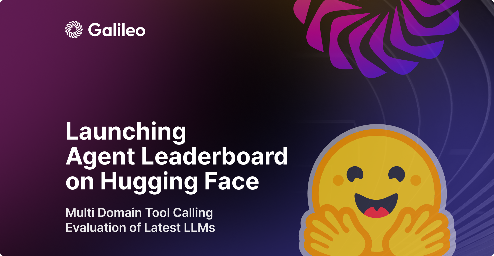
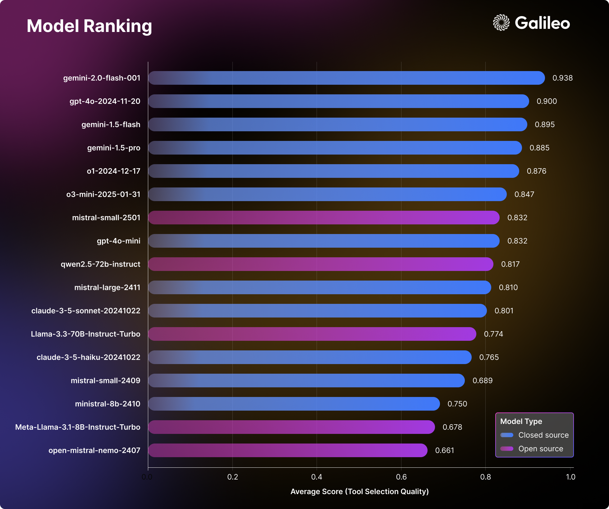

# Agent Leaderboard

<p align="center">
  
</p>

A comprehensive evaluation framework for AI agents and their tool-calling capabilities across real-world business scenarios.

[](https://huggingface.co/spaces/galileo-ai/agent-leaderboard)
[](https://galileo.ai/blog/agent-leaderboard)
[](https://huggingface.co/datasets/galileo-ai/agent-leaderboard)
[](https://www.galileo.ai/agentic-evaluations)

## Overview

This repository evaluates how AI agents perform in real-world business scenarios, providing insights into language models' tool-calling capabilities.

**Two versions available:**
- **v1**: Live production leaderboard with 17+ models across established benchmarks
- **v2**: Enhanced framework with synthetic dataset generation (coming soon)

## Version 1 (Current)

**Status**: ✅ Live and actively maintained

Evaluates language models using standardized benchmarks and the Tool Selection Quality (TSQ) metric.

**Features:**
- [Live leaderboard](https://huggingface.co/spaces/galileo-ai/agent-leaderboard) on Hugging Face Spaces
- 17+ models evaluation across 4 major datasets (BFCL, τ-bench, xLAM, ToolACE)
- Multi-domain coverage: Mathematics, Entertainment, Education, Retail, Airline, and 390+ API domains

<p align="center">
  
</p>

[→ View v1 Documentation](v1/README.md)

## Version 2 (Coming Soon)

**Status**: 🔬 In development

Revolutionary approach using synthetic dataset generation and agent-user conversation simulation.

**New Capabilities:**
- Generate domain-specific tools, personas, and scenarios
- Simulate realistic conversations between AI agents and users
- Support for Banking, Healthcare, Investment, Telecom, Automobile, Insurance domains
- Advanced evaluation categories: Adaptive Tool Use, Scope Management, Empathetic Resolution

**Key Improvements:**
- Scalable testing with unlimited scenarios
- Multi-turn conversations with evolving requirements
- Enhanced metrics beyond basic tool selection

[→ View v2 Documentation](v2/README.md)

## Use Cases

- **Model Developers**: Benchmark language models against industry standards
- **Enterprise Teams**: Evaluate agents for specific business domains  
- **Researchers**: Study tool-calling capabilities and agent behavior
- **Product Teams**: Validate agent performance before deployment

## Repository Structure

```
agent-leaderboard/
├── v1/          # Production leaderboard (current)
├── v2/          # Enhanced framework (upcoming)
└── README.md    # This file
```

## Citation

```bibtex
@misc{agent-leaderboard,
    author = {Pratik Bhavsar},
    title = {Agent Leaderboard},
    year = {2025},
    publisher = {Galileo.ai},
    howpublished = "\url{https://huggingface.co/spaces/galileo-ai/agent-leaderboard}"
}
```

---

*Advancing AI agent evaluation through comprehensive benchmarking and innovative simulation techniques.*
