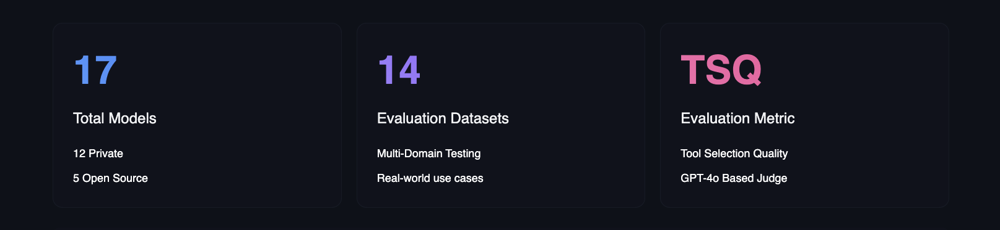
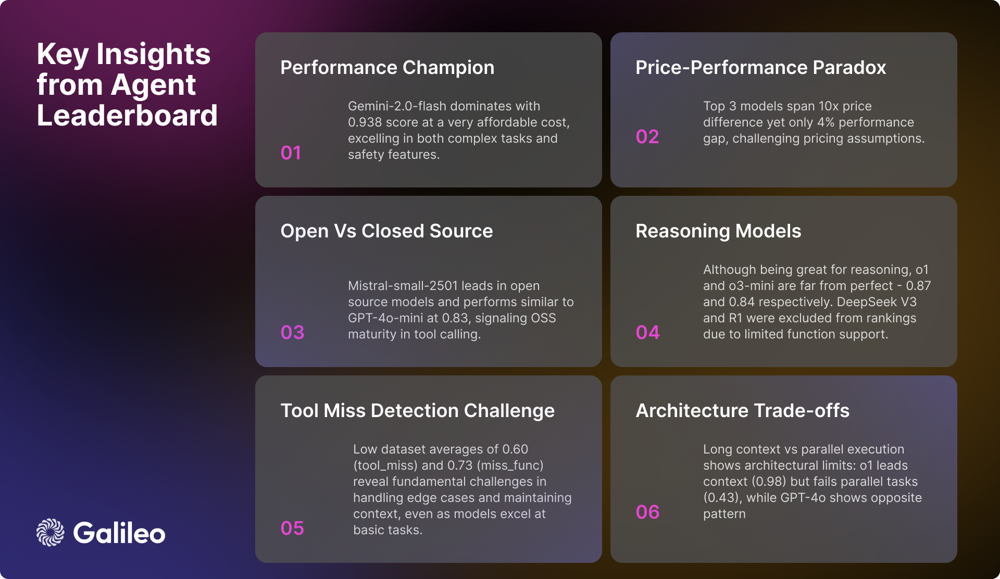
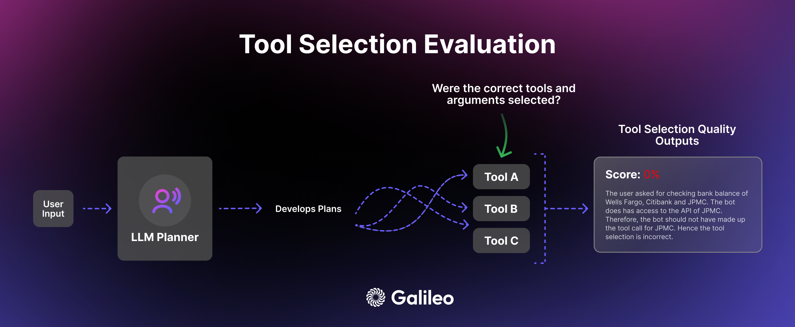

# Agent Leaderboard

<p align="center">
  
</p>

<div align="center">

[](https://huggingface.co/spaces/galileo-ai/agent-leaderboard)
[](https://galileo.ai/blog/agent-leaderboard)
[](https://huggingface.co/datasets/galileo-ai/agent-leaderboard)

</div>

## Overview

The Agent Leaderboard evaluates language models' ability to effectively utilize tools in complex scenarios. With major tech CEOs predicting 2025 as a pivotal year for AI agents, we built this leaderboard to answer: **"How do AI agents perform in real-world business scenarios?"**

Get latest update of the [leaderboard](https://huggingface.co/spaces/galileo-ai/agent-leaderboard) on Hugging Face Spaces. For further info, checkout the [blog post](https://galileo.ai/blog/agent-leaderboard) for a detailed overview of our evaluation methodology.

<p align="center">
  
</p>

### Methodology

Our evaluation process follows a systematic approach:

**Model Selection**: Curated diverse set of leading language models (12 private, 5 open-source)  
**Agent Configuration**: Standardized system prompt and consistent tool access  
**Metric Definition**: [Tool Selection Quality (TSQ)](https://docs.galileo.ai/galileo/gen-ai-studio-products/galileo-guardrail-metrics/tool-selection-quality#tool-selection-quality) as primary metric  
**Dataset Curation**: Strategic sampling from established benchmarks  
**Scoring System**: Equally weighted average across datasets

## Model Rankings

Current standings across different models:

<p align="center">
  
</p>

## Development Guidelines

Key considerations for implementing AI agents:

<p align="center">
  
</p>

## Key Insights

Analysis of model performance and capabilities:

<p align="center">
  
</p>

## Tool Selection Complexity

Understanding the nuances of tool selection and usage across different scenarios:

<p align="center">
  
</p>

## Dataset Structure

Comprehensive evaluation across multiple domains and interaction types by leveraging diverse datasets:

**BFCL**: Mathematics, Entertainment, Education, and Academic Domains  
**τ-bench**: Retail and Airline Industry Scenarios  
**xLAM**: Cross-domain Data Generation (21 Domains)  
**ToolACE**: API Interactions across 390 Domains  

<p align="center">
  
</p>

## Evaluation

Our evaluation metric [Tool Selection Quality (TSQ)](https://docs.galileo.ai/galileo/gen-ai-studio-products/galileo-guardrail-metrics/tool-selection-quality#tool-selection-quality) assesses how well models select and use tools based on real-world requirements:

<p align="center">
  
</p>

### Implementation

Here's how we evaluate the models using the Tool Selection Quality (TSQ) metric:

```python
import promptquality as pq

# Initialize evaluation handler with TSQ scorer
chainpoll_tool_selection_scorer = pq.CustomizedChainPollScorer(
    scorer_name=pq.CustomizedScorerName.tool_selection_quality,
    model_alias=pq.Models.gpt_4o,
)

evaluate_handler = pq.GalileoPromptCallback(
    project_name=project_name,
    run_name=run_name,
    scorers=[chainpoll_tool_selection_scorer],
)

# Configure LLM with zero temperature for consistent evaluation
llm = llm_handler.get_llm(model, temperature=0.0, max_tokens=4000)

# System prompt for standardized tool usage
system_msg = {
    "role": "system",
    "content": """Your job is to use the given tools to answer the query of human. 
                 If there is no relevant tool then reply with "I cannot answer the question with given tools". 
                 If tool is available but sufficient information is not available, then ask human to get the same. 
                 You can call as many tools as you want. Use multiple tools if needed. 
                 If the tools need to be called in a sequence then just call the first tool."""
}

# Run evaluation
for row in df.itertuples():
    chain = llm.bind_tools(tools)
    outputs.append(
        chain.invoke(
            [system_msg, *row.conversation], 
            config=dict(callbacks=[evaluate_handler])
        )
    )

evaluate_handler.finish()
```

## Repo Structure

```
agent-leaderboard/
├── data/                   # Data storage directory
├── datasets/ 
│   ├── bfcl.ipynb          # BFCL data conversion
│   ├── tau.ipynb           # Tau benchmark data conversion
│   ├── toolace.ipynb       # ToolACE data conversion
│   └── xlam.ipynb          # XLAM data conversion
├── evaluate/ 
│   ├── get_results.ipynb   # Results aggregation
│   ├── llm_handler.py      # LLM initialization handler
│   ├── test_r1.ipynb       # Test R1
│   └── tool_call_exp.ipynb # Tool calling experiment runner
├── .env                    # Environment variables for API keys
├── LICENSE 
├── README.md 
└── requirements.txt        # Dependencies
```

## Acknowledgements

We extend our sincere gratitude to the creators of the benchmark datasets that made this evaluation framework possible:

- [**BFCL**](https://gorilla.cs.berkeley.edu/leaderboard.html): Thanks to the Berkeley AI Research team for their comprehensive dataset evaluating function calling capabilities.

- [**τ-bench**](https://github.com/sierra-research/tau-bench): Thanks to the Sierra Research team for developing this benchmark focusing on real-world tool use scenarios.

- [**xLAM**](https://www.salesforce.com/blog/xlam-large-action-models/): Thanks to the Salesforce AI Research team for their extensive Large Action Model dataset covering 21 domains.

- [**ToolACE**](https://arxiv.org/abs/2409.00920): Thanks to the team for their comprehensive API interaction dataset spanning 390 domains.

These datasets have been instrumental in creating a comprehensive evaluation framework for tool-calling capabilities in language models.

## Citation

```bibtex
@misc{agent-leaderboard,
    author = {Pratik Bhavsar},
    title = {Agent Leaderboard},
    year = {2025},
    publisher = {Galileo.ai},
    howpublished = "\url{https://huggingface.co/spaces/galileo-ai/agent-leaderboard}"
}
