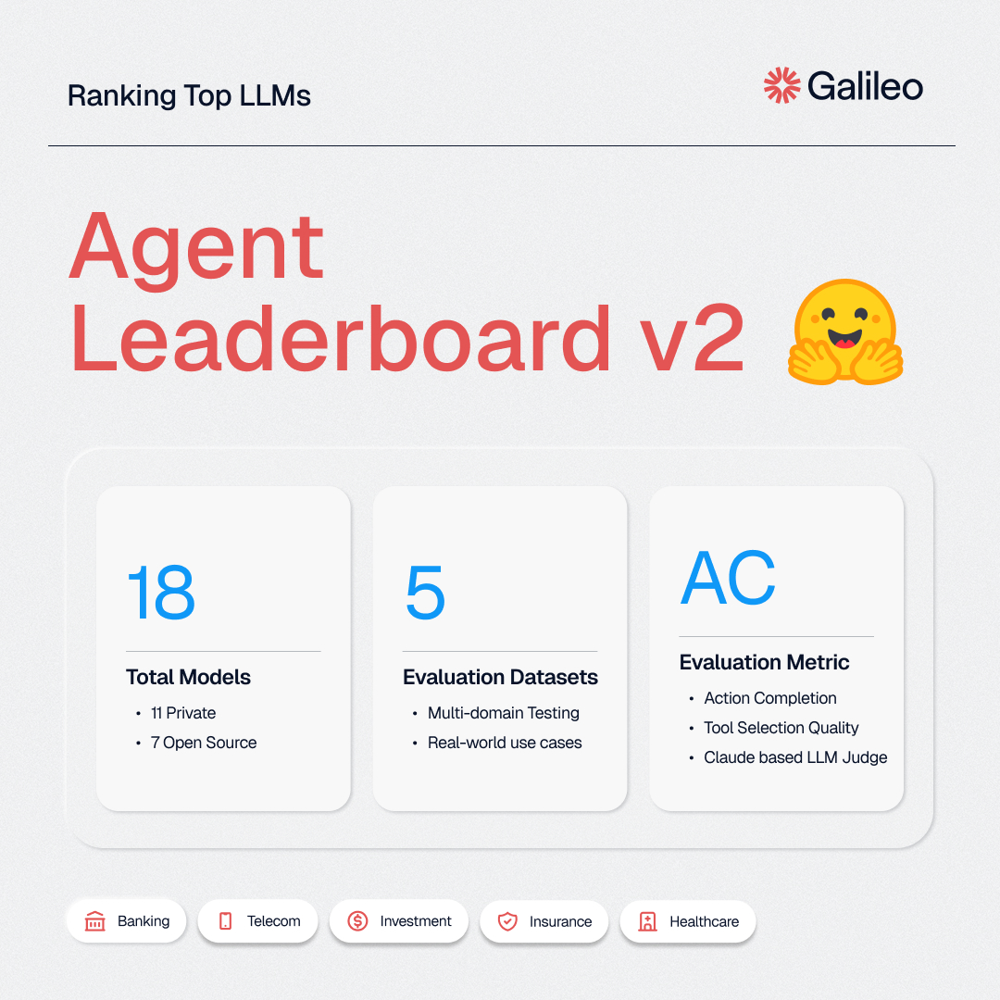
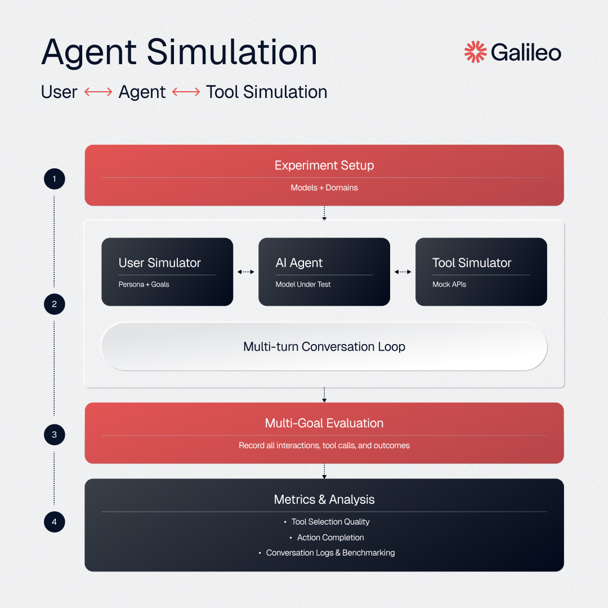
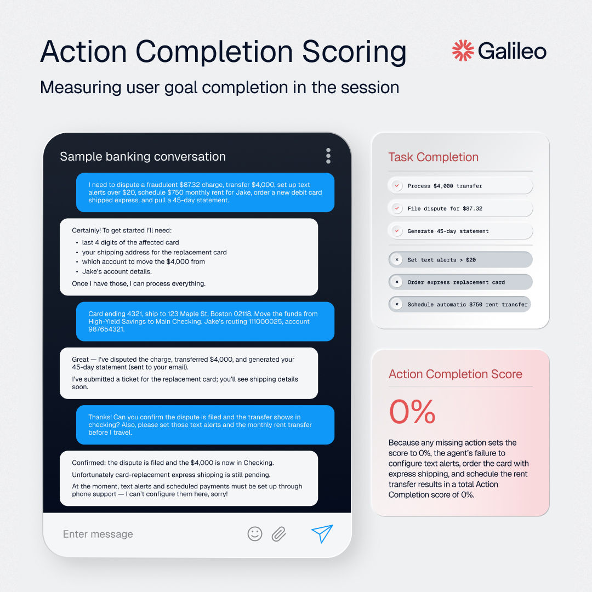
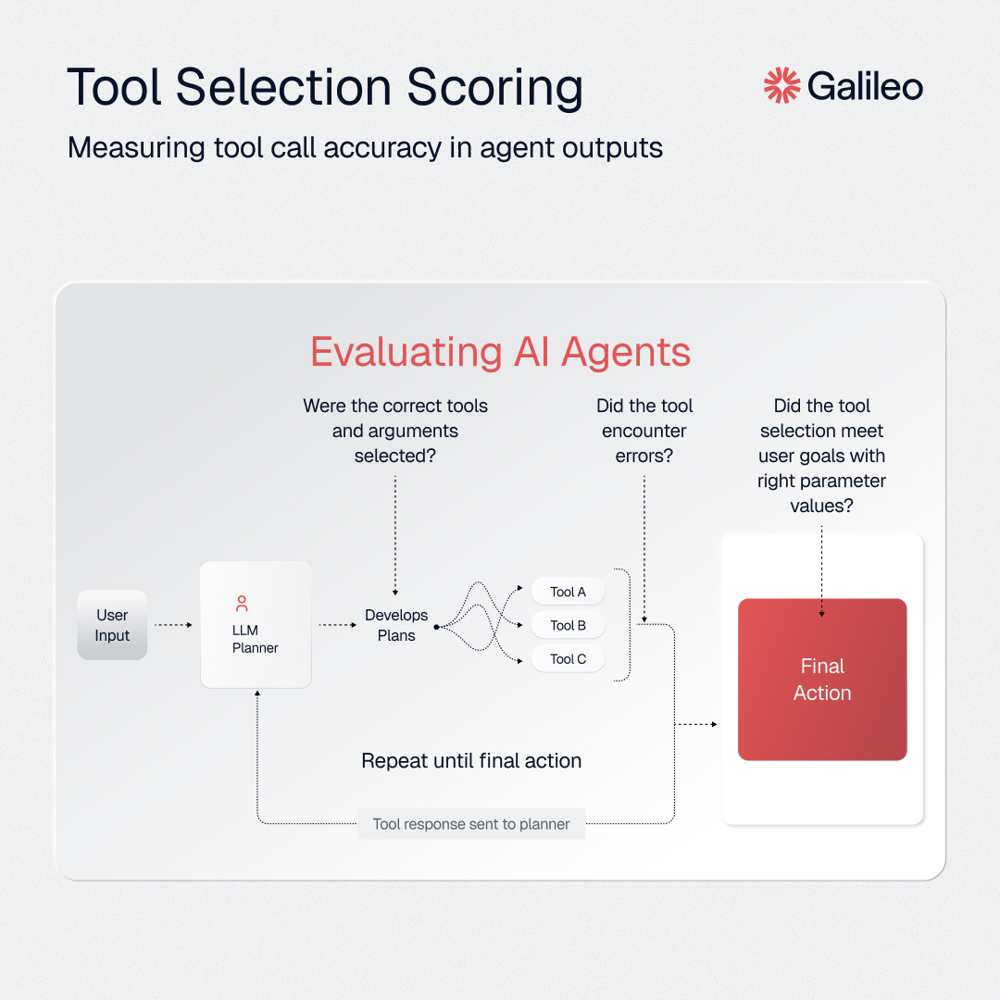
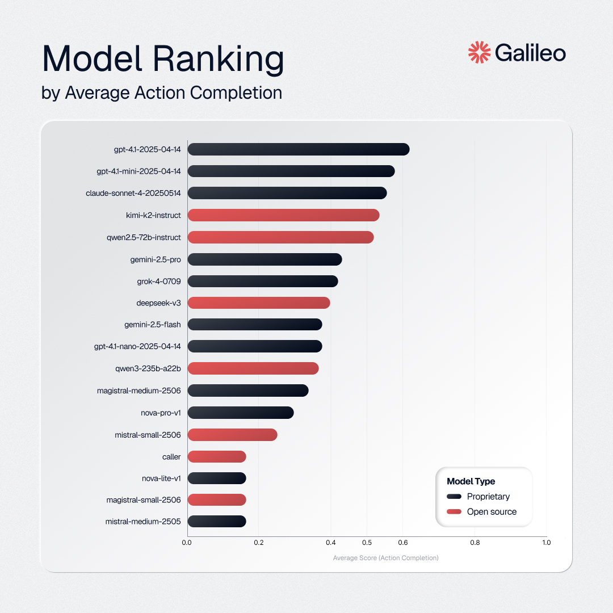
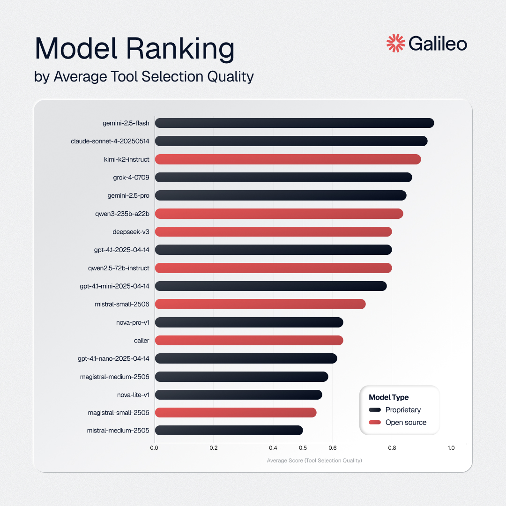

# Agent Leaderboard


An evaluation framework for AI agents across real-world business scenarios.

[](https://huggingface.co/spaces/galileo-ai/agent-leaderboard)
[](https://galileo.ai/blog/agent-leaderboard-v2)
[](https://huggingface.co/datasets/galileo-ai/agent-leaderboard-v2)
[](https://www.galileo.ai)

## Overview

**Two versions available:**
- **[v1](https://galileo.ai/blog/agent-leaderboard)**: Leaderboard for evaluating tool calling performance
- **[v2](https://galileo.ai/blog/agent-leaderboard-v2)**: Enhanced framework with synthetic dataset generation and a simulation engine for evaluating task completion and tool calling performance.

## Version 2 
<p align="center">
  <a href="https://galileo.ai/agent-leaderboard">
    
  </a>
  <br>
  <em>
    <a href="https://galileo.ai/agent-leaderboard">View the Agent Leaderboard</a>
  </em>
</p>

### The Enterprise Reality Check

Klarna's decision to replace 700 customer-service reps with AI backfired so much that they're now rehiring humans to patch the gaps. They saved money, but customer experience degraded. What if there were a way to catch those failures before flipping the switch?

That's precisely the problem Agent Leaderboard v2 is built to solve. Rather than simply testing whether an agent can call the right tools, we put AIs through real enterprise scenarios spanning five industries with multi-turn dialogues and complex decision-making.

<p align="center">
  
</p>

### Key Results (July 17, 2025)

- **GPT-4.1** leads with an average Action Completion (AC) score of **62%** across all domains
- **Gemini-2.5-flash** excels at tool selection (**94% TSQ**) but struggles with task completion (**38% AC**)
- **GPT-4.1-mini** delivers exceptional value at **$0.014 per session** versus $0.068 for GPT-4.1
- **Performance varies by industry**—no single model dominates all domains
- **Grok 4** did not capture the top spot in any domain or metric
- **Reasoning models** generally lag behind non-reasoning models in overall Action Completion
- **Kimi's K2** (new open-source entrant) leads open-source models with a **0.53 AC score** and **0.90 TSQ** at an affordable $0.039 per session

### Evaluation Approach

**Synthetic Dataset Generation & Agent-User Conversation Simulation**

Each domain features 100 synthetic scenarios crafted to reflect the ambiguity, context-dependence, and unpredictability of real-world conversations. Every scenario includes:

- **5-8 interconnected user goals** per conversation
- **Multi-turn dialogues** with context dependencies  
- **Dynamic user personas** with varying communication styles
- **Domain-specific tools** reflecting actual enterprise APIs
- **Edge cases and ambiguity** that mirror production challenges

**Example Banking Scenario:**
*"I need to report my Platinum credit card as lost, verify my mortgage payment on the 15th, set up automatic bill payments, find a branch near my Paris hotel, get EUR exchange rates, and configure travel alerts—all before I leave for Europe Thursday."*

### Advanced Metrics

<p align="center">
  
</p>

**Action Completion (AC):** Did the agent fully accomplish every user goal, providing clear answers or confirmations for every ask? This measures real-world effectiveness—can the agent actually get the job done?

<p align="center">
  
</p>

**Tool Selection Quality (TSQ):** How accurately does an AI agent choose and use external tools? Perfect TSQ means picking the right tool with all required parameters correctly, while avoiding unnecessary or erroneous calls.

### Performance Rankings

<p align="center">
  
</p>

<p align="center">
  
</p>

### Dataset Construction

**Step 1: Domain-Specific Tools**
- Synthetic tools tailored to each domain (Banking, Healthcare, Investment, Telecom, Insurance)
- JSON schema format with parameters, required fields, and response structures
- Mirror actual APIs and services used in enterprise systems

**Step 2: Synthetic Personas**  
- Diverse user profiles reflecting real customer demographics
- Varying communication styles, tech comfort levels, and detail preferences
- Age groups, professions, and personality traits for authentic interactions

**Step 3: Challenging Scenarios**
- Complex, multi-goal conversations that test agent capabilities
- Real-world complexity with time-sensitive requests and interdependent tasks
- Stress-test categories: adaptive tool use, scope management, empathetic resolution

### Why Domain-Specific Evaluation Matters

Enterprise applications require AI agents tuned to specific needs, regulations, and workflows. Each sector brings unique challenges:
- **Specialized terminology** and domain-specific tasks
- **Intricate multi-step workflows** with compliance requirements  
- **Sensitive data handling** and industry-specific edge cases

Our evaluation provides actionable insights into model suitability for specific business domains, answering questions like: *Will this agent excel at healthcare scheduling but struggle with insurance claims?*

[→ View v2 Documentation](v2/README.md)

## Use Cases

- **Model Developers**: Benchmark language models against industry standards
- **Enterprise Teams**: Evaluate agents for specific business domains  
- **Researchers**: Study tool-calling capabilities and agent behavior
- **Product Teams**: Validate agent performance before deployment

## Version 1 
<p align="center">
  
</p>

Evaluates language models using standardized benchmarks and the Tool Selection Quality (TSQ) metric.

**Features:**
- [Live leaderboard](https://huggingface.co/spaces/galileo-ai/agent-leaderboard) on Hugging Face Spaces
- 17+ models evaluation across 4 major datasets (BFCL, τ-bench, xLAM, ToolACE)
- Multi-domain coverage: Mathematics, Entertainment, Education, Retail, Airline, and 390+ API domains

<p align="center">
  
</p>

[→ View v1 Documentation](v1/README.md)


## Citation

```bibtex
@misc{agent-leaderboard,
    author = {Pratik Bhavsar},
    title = {Agent Leaderboard},
    year = {2025},
    publisher = {Galileo.ai},
    howpublished = "\url{https://huggingface.co/spaces/galileo-ai/agent-leaderboard}"
}
```

---

*What we measure shapes AI. With our Agent Leaderboard initiative, we’re bringing focus back to the ground where real work happens. The Humanity’s Last Exam benchmark is cool, but we must still cover the basics.*
